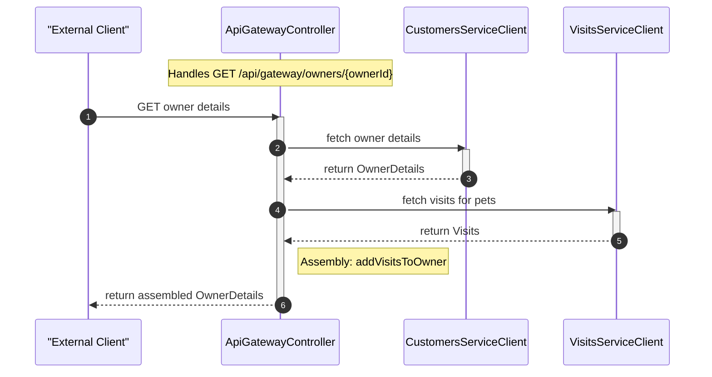
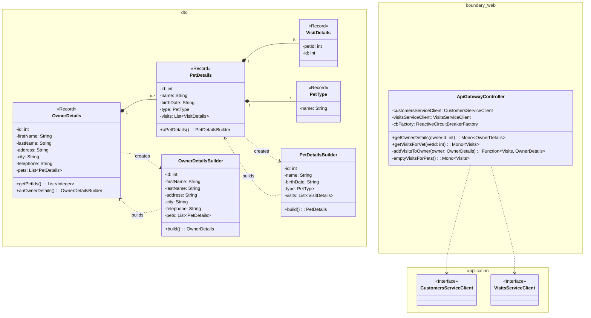

# System Architecture Overview

The API gateway that aggregates and routes requests between the AngularJS frontend and backend microservices in the Spring PetClinic microservices architecture.

The PetClinic API Gateway serves as the central entry point for client-side requests, combining owner data from the customers-service with visit data from the visits-service into unified responses. It applies Resilience4J circuit breaker patterns to protect downstream services and provides a built-in AngularJS single-page application for end-user interaction with owner, pet, veterinarian, and visit management features.

## Architecture

The gateway is a Spring Boot WebFlux application that leverages Spring Cloud Gateway, Netflix Eureka service discovery, and reactive HTTP clients to route and aggregate requests across the PetClinic microservice ecosystem.

```mermaid
flowchart TB
    %% Nodes with context sources
    user([End User]) %% External user, implied by context #2 Cluster_0 (frontend navigation)
    frontend[Angular Frontend] %% Source: context #1 entry points (index.html, app.js) and context #2 Cluster_10
    api_gateway{{API Gateway}} %% Spring Boot, source: context #1 ApiGatewayApplication and ApiGatewayController
    customers_service[Customers Service] %% External backend, source: context #1 CustomersServiceClient
    visits_service[Visits Service] %% External backend, source: context #1 VisitsServiceClient

    %% Edges with labels
    user -->|Interacts with| frontend
    frontend -->|HTTP Requests (e.g., /api/gateway/owners/*)| api_gateway
    api_gateway -->|Customers API (with Circuit Breaker and 10s Time Limiter)| customers_service
    api_gateway -->|Visits API (with Circuit Breaker and 10s Time Limiter)| visits_service
    api_gateway -->|Serves Static Files (index.html, app.js)| frontend

    %% Subgraphs for tier organization
    subgraph User_Tier [User and Frontend]
        user
        frontend
    end

    subgraph API_Gateway_Tier [API Gateway with Resilience]
        api_gateway
        %% Resilience patterns configured in ApiGatewayApplication and CircuitBreakerConfiguration
        %% source: context #1 defaultCustomizer (10s timeout) and context #2 Cluster_6
    end

    subgraph Backend_Services_Tier [Backend Services]
        customers_service
        visits_service
    end

    %% Legend for relationship types
    %% Solid edges: Request/Response
    %% Dashed edges: Not used here
    %% Edge labels indicate protocol and resilience patterns
    %% -----------------------------
    %% Source comments for all elements
    %% source: context #1 for classes, clients, and resilience configuration
    %% source: context #2 for cluster descriptions and architecture overview
```

### Core Components

| Component | Location | Responsibility |
|---|---|---|
| **ApiGatewayApplication** | `ApiGatewayApplication.java` | Bootstraps the application, configures Eureka discovery, load-balanced clients, static resource routing, and Resilience4J defaults |
| **ApiGatewayController** | `boundary/web/ApiGatewayController.java` | Exposes gateway REST endpoints that fetch and combine data from downstream services |
| **CustomersServiceClient** | `application/CustomersServiceClient.java` | Reactive HTTP client that calls the `customers-service` for owner and pet data |
| **VisitsServiceClient** | `application/VisitsServiceClient.java` | Reactive HTTP client that calls the `visits-service` for visit data |
| **FallbackController** | `boundary/web/FallbackController.java` | Returns HTTP 503 responses when the chat service is unavailable |
| **DTOs** | `dto/` package | Java records and builders (`OwnerDetails`, `PetDetails`, `PetType`, `VisitDetails`, `Visits`) used for data transfer between services |
| **AngularJS Frontend** | `resources/static/` | Single-page application with modules for owner list, owner details, owner form, pet form, vet list, visits, and chat |

### Request Flow

The `ApiGatewayController` coordinates two backend calls for the owner details endpoint:

1. **Fetch owner** — calls `CustomersServiceClient.getOwner()`, which issues an HTTP GET to the `customers-service`
2. **Fetch visits** — calls `VisitsServiceClient.getVisitsForPets()` with the pet IDs extracted from the owner, which issues an HTTP GET to the `visits-service`
3. **Enrich and return** — the `addVisitsToOwner` function merges visit data into each pet's visit list before returning the combined `OwnerDetails` response

Both backend calls are wrapped in Resilience4J circuit breakers. If the visits call fails, the gateway returns the owner with an empty visits list rather than failing the entire request.



### Resilience Configuration

The application configures a global Resilience4J circuit breaker default via `ReactiveResilience4JCircuitBreakerFactory` with:

- **Circuit breaker**: Default settings (50% failure rate threshold, 10-call minimum, 10-second sliding window)
- **Time limiter**: 10-second timeout duration

Each gateway endpoint creates a named circuit breaker instance (`getOwnerDetails`, `getVisitsForVet`) that falls back to a safe default on failure.

### Load Balancing

Both `WebClient.Builder` and `RestTemplate` beans are annotated with `@LoadBalanced`, enabling service-name-based resolution through Netflix Eureka. The service clients use logical hostnames (e.g., `http://customers-service/owners/{ownerId}`) rather than hardcoded URLs.

### Static Resource Routing

A Spring WebFlux `RouterFunction` serves the AngularJS frontend from the classpath `static/` directory and forwards the root path (`/`) to `index.html`.

## Directory Structure

```
petclinic-api-gateway/
├── pom.xml                                          # Maven build (Spring Boot, Spring Cloud, Resilience4J, WebJars)
├── src/
│   ├── main/
│   │   ├── java/org/springframework/samples/petclinic/api/
│   │   │   ├── ApiGatewayApplication.java           # Application entry point and configuration
│   │   │   ├── application/
│   │   │   │   ├── CustomersServiceClient.java      # HTTP client for customers-service
│   │   │   │   └── VisitsServiceClient.java         # HTTP client for visits-service
│   │   │   ├── boundary/web/
│   │   │   │   ├── ApiGatewayController.java        # Gateway REST endpoints
│   │   │   │   └── FallbackController.java          # 503 fallback endpoint
│   │   │   └── dto/
│   │   │       ├── OwnerDetails.java                # Owner data transfer record + builder
│   │   │       ├── PetDetails.java                  # Pet data transfer record + builder
│   │   │       ├── PetType.java                     # Pet type record
│   │   │       ├── VisitDetails.java                # Visit data transfer record
│   │   │       └── Visits.java                      # Visits list wrapper
│   │   └── resources/static/
│   │       ├── index.html                           # SPA entry point
│   │       └── scripts/
│   │           ├── app.js                           # Angular module, routing, HTTP interceptor config
│   │           ├── infrastructure/                  # HTTP error handling interceptor
│   │           ├── genai/                           # Chat interface (sendMessage, chat history)
│   │           ├── owner-details/                   # Owner details module, controller, template
│   │           ├── owner-form/                      # Owner create/edit form module
│   │           ├── owner-list/                      # Owner search list module
│   │           ├── pet-form/                        # Pet create/edit form module
│   │           ├── vet-list/                        # Veterinarian list module
│   │           ├── visits/                          # Visit form and list module
│   │           └── fragments/                       # Shared HTML fragments (nav, footer, welcome)
│   └── test/java/org/springframework/samples/petclinic/api/
│       ├── ApiGatewayApplicationTests.java          # Application context smoke test
│       ├── application/
│       │   └── VisitsServiceClientIntegrationTest.java  # Integration test with MockWebServer
│       └── boundary/web/
│           ├── ApiGatewayControllerTest.java        # Controller unit tests with mocked clients
│           └── CircuitBreakerConfiguration.java     # Test circuit breaker bean configuration
```

## DTO Layer

The gateway defines a set of Java records and builder classes for structured data transfer between services and the frontend.



| DTO | Fields | Purpose |
|---|---|---|
| `OwnerDetails` | `id`, `firstName`, `lastName`, `address`, `city`, `telephone`, `pets` | Owner information with nested pet list; includes `getPetIds()` helper |
| `PetDetails` | `id`, `name`, `birthDate`, `type`, `visits` | Pet information with visit history; compact constructor ensures non-null `visits` |
| `PetType` | `name` | Pet species/category label |
| `VisitDetails` | `id`, `petId`, `vetId`, `date`, `description` | Individual visit record |
| `Visits` | `items` (list of `VisitDetails`) | Wrapper for a collection of visits; defaults to empty list |

Both `OwnerDetails` and `PetDetails` include fluent builder classes (`OwnerDetailsBuilder`, `PetDetailsBuilder`) for programmatic construction in tests and service logic.

## Service Clients

### CustomersServiceClient

Communicates with the `customers-service` using a load-balanced `WebClient.Builder`. Issues an HTTP GET to fetch a single owner by ID and returns a reactive `Mono<OwnerDetails>`.

### VisitsServiceClient

Communicates with the `visits-service` using a load-balanced `WebClient.Builder`. Provides two methods:

- `getVisitsForPets(List<Integer> petIds)` — joins pet IDs into a comma-separated query parameter and fetches all matching visits
- `getVisitsForVet(int vetId)` — fetches all visits for a specific veterinarian

The `hostname` field is configurable for integration testing with `MockWebServer`.

## Frontend Architecture

The AngularJS single-page application is organized into feature modules, each with a component, controller, template, and routing configuration:

| Module | Route | Functionality |
|---|---|---|
| `ownerList` | `/owners` | Search and list owners |
| `ownerDetails` | `/owners/:ownerId` | Display owner details with pets and visits |
| `ownerForm` | `/owners/new`, `/owners/:ownerId/edit` | Create or edit an owner |
| `petForm` | `/owners/:ownerId/pets/new`, `/pets/:petId/edit` | Create or edit a pet |
| `vetList` | `/vets` | Display list of veterinarians |
| `visits` | `/owners/:ownerId/pets/:petId/visits` | View and add visits for a pet |

The frontend uses `angular-ui-router` for state-based navigation and an HTTP interceptor (`httpErrorHandlingInterceptor`) that maps backend error responses to user-facing alerts. A chat interface (`genai/chat.js`) provides interactive support with Markdown rendering and localStorage-based message persistence.

## Testing

The test suite covers three levels:

- **Application smoke test** (`ApiGatewayApplicationTests`) — verifies the Spring context loads
- **Controller unit tests** (`ApiGatewayControllerTest`) — tests gateway endpoints with mocked service clients and circuit breaker configuration
- **Integration tests** (`VisitsServiceClientIntegrationTest`) — uses OkHttp `MockWebServer` to validate the visits client against simulated backend responses