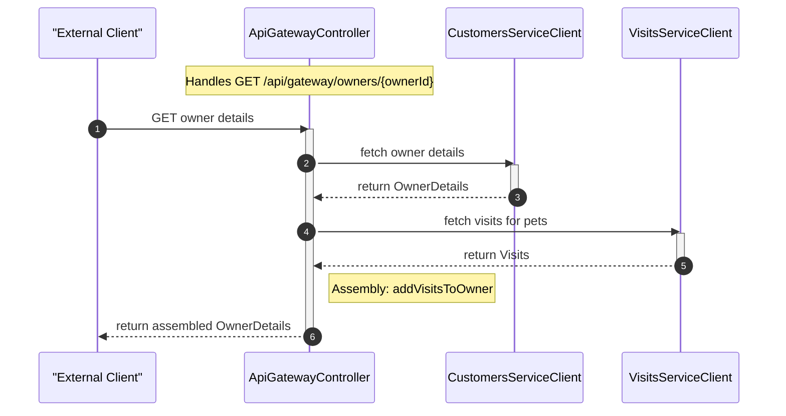

# PetClinic API Gateway Architecture

The API gateway that aggregates and routes requests between the AngularJS frontend and backend microservices in the Spring PetClinic microservices architecture.

The PetClinic API Gateway serves as the central entry point for client-side requests, combining owner data from the customers-service with visit data from the visits-service into unified responses. It fetches veterinarian details from the vets-service and enriches owner search results with visit counts. It applies Resilience4J circuit breaker patterns to protect downstream services and provides a built-in AngularJS single-page application for end-user interaction with owner, pet, veterinarian, and visit management features.

## Architecture

The gateway is a Spring Boot WebFlux application that leverages Spring Cloud Gateway, Netflix Eureka service discovery, and reactive HTTP clients to route and aggregate requests across the PetClinic microservice ecosystem.

```mermaid
flowchart TB
    user([End User]) %% External user, implied by context #2 Cluster_0 (frontend navigation)
    frontend[Angular Frontend] %% Source: context #1 entry points (index.html, app.js) and context #2 Cluster_10
    api_gateway{{API Gateway}} %% Spring Boot, source: context #1 ApiGatewayApplication and ApiGatewayController
    customers_service[Customers Service] %% External backend, source: context #1 CustomersServiceClient
    visits_service[Visits Service] %% External backend, source: context #1 VisitsServiceClient
    vets_service[Vets Service] %% External backend, source: context #1 VetsServiceClient

    user -->|Interacts with| frontend
    frontend -->|HTTP Requests (e.g., /api/gateway/owners/*, /api/gateway/vets/*)| api_gateway
    api_gateway -->|Customers API (with Circuit Breaker and 10s Time Limiter)| customers_service
    api_gateway -->|Visits API (with Circuit Breaker and 10s Time Limiter)| visits_service
    api_gateway -->|Vets API (with Circuit Breaker and 10s Time Limiter)| vets_service
    api_gateway -->|Serves Static Files (index.html, app.js)| frontend

    subgraph User_Tier [User and Frontend]
        user
        frontend
    end

    subgraph API_Gateway_Tier [API Gateway with Resilience]
        api_gateway
    end

    subgraph Backend_Services_Tier [Backend Services]
        customers_service
        visits_service
        vets_service
    end
```


### Core Components

| Component | Location | Responsibility |
|---|---|---|
| **ApiGatewayApplication** | `ApiGatewayApplication.java` | Bootstraps the application, configures Eureka discovery, load-balanced clients, static resource routing, and Resilience4J defaults |
| **ApiGatewayController** | `boundary/web/ApiGatewayController.java` | Exposes gateway REST endpoints that fetch and combine data from downstream services |
| **CustomersServiceClient** | `application/CustomersServiceClient.java` | Reactive HTTP client that calls the `customers-service` for owner data and owner search |
| **VisitsServiceClient** | `application/VisitsServiceClient.java` | Reactive HTTP client that calls the `visits-service` for visit data |
| **VetsServiceClient** | `application/VetsServiceClient.java` | Reactive HTTP client that calls the `vets-service` for veterinarian data |
| **FallbackController** | `boundary/web/FallbackController.java` | Returns HTTP 503 responses when downstream services are unavailable |
| **DTOs** | `dto/` package | Java records and builders (`OwnerDetails`, `OwnerSummary`, `PetDetails`, `PetType`, `VetDetails`, `VisitDetails`, `Visits`) used for data transfer between services |
| **AngularJS Frontend** | `resources/static/` | Single-page application with modules for owner list, owner details, owner form, pet form, vet list, visits, and chat |

### Request Flow

#### Owner Details Aggregation

The `ApiGatewayController` coordinates two backend calls for the owner details endpoint:

1. **Fetch owner** — calls `CustomersServiceClient.getOwner()`, which issues an HTTP GET to the `customers-service`
2. **Fetch visits** — calls `VisitsServiceClient.getVisitsForPets()` with the pet IDs extracted from the owner, which issues an HTTP GET to the `visits-service`
3. **Enrich and return** — the `addVisitsToOwner` function merges visit data into each pet's visit list before returning the combined `OwnerDetails` response

Both backend calls are wrapped in Resilience4J circuit breakers. If the visits call fails, the gateway returns the owner with an empty visits list rather than failing the entire request.




#### Vet Details

The `getVetDetails` endpoint calls `VetsServiceClient.getVet()` to fetch a single veterinarian by ID from the `vets-service`. The call is wrapped in a Resilience4J circuit breaker that returns an empty `Mono` on failure.

#### Owner Search with Visit Enrichment

The `searchOwners` endpoint searches owners by last name prefix via `CustomersServiceClient.searchOwners()`, then enriches each result with visit counts from the `visits-service`. Visit counts are fetched per owner through `VisitsServiceClient.getVisitsForPets()` with circuit breaker protection. Results are returned as a `Flux<OwnerSummary>`.

### Resilience Configuration

The application configures a global Resilience4J circuit breaker default via `ReactiveResilience4JCircuitBreakerFactory` with:

- **Circuit breaker**: Default settings (50% failure rate threshold, 10-call minimum, 100-call sliding window)
- **Time limiter**: 10-second timeout duration

Each gateway endpoint creates a named circuit breaker instance (`getOwnerDetails`, `getVetDetails`, `getVisitsForVet`, `searchOwners`) that falls back to a safe default on failure.

### Load Balancing

Both `WebClient.Builder` and `RestTemplate` beans are annotated with `@LoadBalanced`, enabling service-name-based resolution through Netflix Eureka. The service clients use logical hostnames (e.g., `http://customers-service/owners/{ownerId}`) rather than hardcoded URLs.

### Static Resource Routing

A Spring WebFlux `RouterFunction` serves the AngularJS frontend from the classpath `static/` directory and forwards the root path (`/`) to `index.html`.

## Project Structure

```
petclinic-api-gateway/
├── pom.xml                                          # Maven build (Spring Boot, Spring Cloud, Resilience4J, WebJars)
├── src/
│   ├── main/
│   │   ├── java/org/springframework/samples/petclinic/api/
│   │   │   ├── ApiGatewayApplication.java           # Application entry point and configuration
│   │   │   ├── application/
│   │   │   │   ├── CustomersServiceClient.java      # HTTP client for customers-service
│   │   │   │   ├── VetsServiceClient.java           # HTTP client for vets-service
│   │   │   │   └── VisitsServiceClient.java         # HTTP client for visits-service
│   │   │   ├── boundary/web/
│   │   │   │   ├── ApiGatewayController.java        # Gateway REST endpoints
│   │   │   │   └── FallbackController.java          # 503 fallback endpoint
│   │   │   └── dto/
│   │   │       ├── OwnerDetails.java                # Owner data transfer record + builder
│   │   │       ├── OwnerSummary.java                # Lightweight owner summary with visit counts
│   │   │       ├── PetDetails.java                  # Pet data transfer record + builder
│   │   │       ├── PetType.java                     # Pet type record
│   │   │       ├── VetDetails.java                  # Veterinarian data transfer record
│   │   │       ├── VisitDetails.java                # Visit data transfer record
│   │   │       └── Visits.java                      # Visits list wrapper
│   │   └── resources/static/
│   │       ├── index.html                           # SPA entry point
│   │       └── scripts/
│   │           ├── app.js                           # Angular module, routing, HTTP interceptor config
│   │           ├── infrastructure/                  # HTTP error handling interceptor
│   │           ├── genai/                           # Chat interface (sendMessage, chat history)
│   │           ├── owner-details/                   # Owner details module, controller, template
│   │           ├── owner-form/                      # Owner create/edit form module
│   │           ├── owner-list/                      # Owner search list module
│   │           ├── pet-form/                        # Pet create/edit form module
│   │           ├── vet-list/                        # Veterinarian list module
│   │           ├── visits/                          # Visit form and list module
│   │           └── fragments/                       # Shared HTML fragments (nav, footer, welcome)
│   └── test/java/org/springframework/samples/petclinic/api/
│       ├── ApiGatewayApplicationTests.java          # Application context smoke test
│       ├── application/
│       │   └── VisitsServiceClientIntegrationTest.java  # Integration test with MockWebServer
│       └── boundary/web/
│           ├── ApiGatewayControllerTest.java        # Controller unit tests with mocked clients
│           └── CircuitBreakerConfiguration.java     # Test circuit breaker bean configuration
```