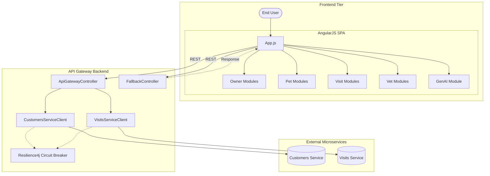
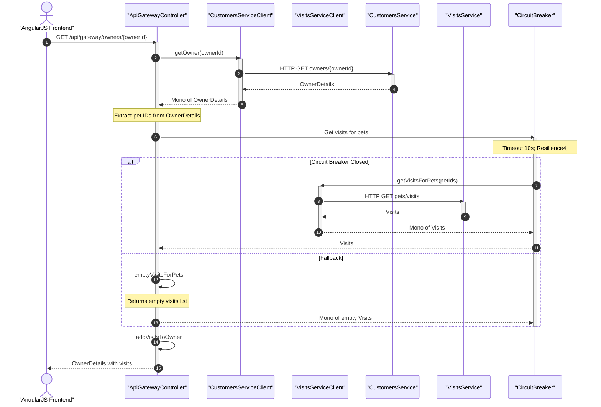
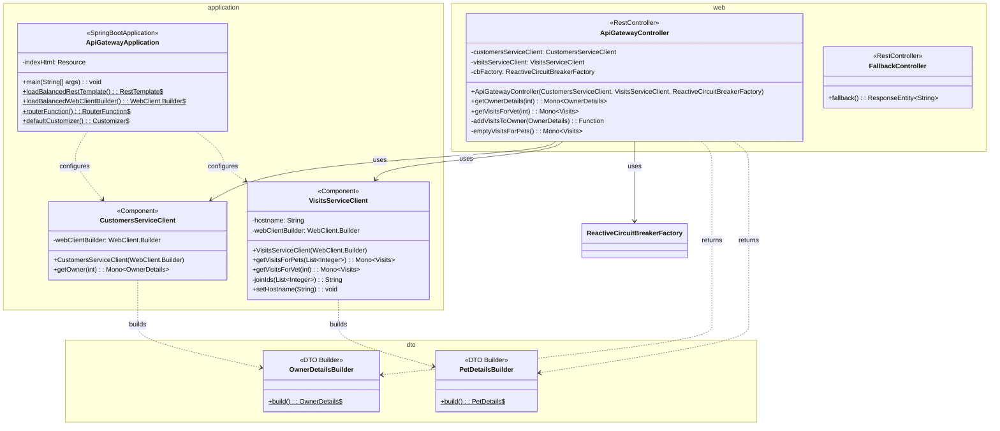

# architecture

## Overview

The PetClinic API Gateway serves as the central entry point for the PetClinic microservices application. It aggregates data from multiple backend services—customers, visits, and veterinarians—and exposes a unified REST API to clients. The gateway also hosts the AngularJS single-page application and implements resilience patterns to ensure graceful degradation when downstream services are unavailable.

The gateway operates as a Spring Boot application with Spring Cloud integration, providing service discovery, load balancing, and circuit breaker capabilities. It bridges the frontend AngularJS application with the backend microservices using reactive WebClient-based service clients.



## Core Components

### Application Bootstrap (`ApiGatewayApplication`)

The `ApiGatewayApplication` class is the Spring Boot entry point. It configures:

- **Service Discovery**: Enabled via `@EnableDiscoveryClient` for Eureka-based registration and discovery.
- **Load-Balanced HTTP Clients**: Both a `RestTemplate` and a `WebClient.Builder` annotated with `@LoadBalanced` for resolving service names to instances.
- **Resilience4j Circuit Breaker**: A `defaultCustomizer` bean configures circuit breaker and time limiter defaults—10-second timeout with standard circuit breaker thresholds.
- **Static Resource Routing**: A `RouterFunction` serves the AngularJS frontend from `static/` and maps the root path to `index.html`.

### Service Clients (`application` package)

Service clients encapsulate all communication with downstream microservices:

| Client | Responsibility | Target Service |
|---|---|---|
| `CustomersServiceClient` | Retrieves owner details by ID | `customers-service` |
| `VisitsServiceClient` | Fetches visits for pets and veterinarians | `visits-service` |

Both clients use Spring's reactive `WebClient` for non-blocking HTTP calls, returning `Mono<T>` types. The `VisitsServiceClient` accepts a configurable hostname, and joins multiple pet IDs into a comma-separated query parameter via `joinIds()`.

### Gateway Controller (`ApiGatewayController`)

The REST controller at `/api/gateway` orchestrates data aggregation across services:

- **`GET /api/gateway/owners/{ownerId}`** — Fetches owner data from the customers service, then retrieves visits for the owner's pets from the visits service. Visit data is mapped onto each pet using the `addVisitsToOwner` function. The visit-fetching call is wrapped in a circuit breaker that falls back to empty visits on failure.
- **`GET /api/gateway/vets/{vetId}/visits`** — Delegates directly to the visits service with circuit breaker protection.

### Fallback Controller (`FallbackController`)

Provides a `POST /fallback` endpoint that returns a 503 Service Unavailable response. This is invoked when circuit breakers trip for chat-related service calls.

### Data Transfer Objects (`dto` package)

The DTO layer defines the data contracts between the gateway and its clients:

- **`OwnerDetails`** — Record containing owner identity, address, and a list of `PetDetails`. Includes `getPetIds()` for extracting pet identifiers and uses a fluent `OwnerDetailsBuilder`.
- **`PetDetails`** — Record for individual pets with name, type, birth date, and visits. Uses `PetDetailsBuilder` with chainable setter methods.
- **`PetType`** — Simple record holding a pet type name.
- **`VisitDetails`** — Record for individual visit data.
- **`Visits`** — Container DTO holding a list of `VisitDetails` with a default empty-list constructor.

### Frontend (AngularJS SPA)

The gateway serves a complete AngularJS single-page application from `static/`. The frontend modules include:

| Module | Purpose |
|---|---|
| `app.js` | Application definition, routing via `ui.router`, HTTP interceptors |
| `owner-list` | Owner search and listing |
| `owner-details` | Owner profile with pets and visits |
| `owner-form` | Create/edit owner forms |
| `pet-form` | Create/edit pet forms |
| `visits` | Visit creation and history |
| `vet-list` | Veterinarian listing |
| `genai/chat.js` | Client-side chat interface with localStorage persistence |
| `infrastructure` | HTTP error handling interceptor |

## Interaction Flow



The primary data flow for an owner details request proceeds as follows:

1. The frontend sends `GET /api/gateway/owners/{ownerId}`.
2. `ApiGatewayController.getOwnerDetails()` calls `CustomersServiceClient.getOwner()`, which resolves the `customers-service` via service discovery and fetches owner data.
3. Owner data (including pet IDs) is extracted via `OwnerDetails.getPetIds()`.
4. `VisitsServiceClient.getVisitsForPets()` is called with the pet ID list, which joins them into a query parameter and requests visit data from the `visits-service`.
5. The circuit breaker wraps the visit call; on failure, `emptyVisitsForPets()` returns an empty list.
6. The `addVisitsToOwner()` function filters visits by pet ID and attaches them to the corresponding `PetDetails` objects.
7. The aggregated `OwnerDetails` is returned to the client.

## Key Design Decisions

**Reactive WebClient over RestTemplate**: Service clients use `WebClient` for non-blocking I/O, enabling efficient resource utilization when aggregating data from multiple services. The `RestTemplate` bean is available but the primary service clients favor reactive patterns.

**Circuit Breaker at the Gateway Layer**: Resilience4j circuit breakers protect each outbound service call independently. The gateway degrades gracefully—returning empty visit data rather than failing the entire owner details request when the visits service is unavailable.

**Data Aggregation in the Gateway**: Rather than having the frontend make multiple service calls, the gateway aggregates owner and visit data into a single response. This reduces client-side complexity and network round trips.

**Service Discovery via Eureka**: All downstream service communication uses logical service names (e.g., `customers-service`, `visits-service`) resolved through Netflix Eureka, enabling load balancing and dynamic instance management.



## Cross-Service Dependencies

The API gateway communicates with three backend services within the PetClinic microservices ecosystem:

- **petclinic-customers-service** — Provides owner and pet data. The `CustomersServiceClient` calls `findOwner` and related endpoints.
- **petclinic-visits-service** — Provides visit data. The `VisitsServiceClient` calls `readByVet` and visit-by-pet endpoints.
- **petclinic-vets-service** — The frontend `vet-list` controller fetches veterinarian data directly from this service.

## Technology Stack

| Layer | Technology |
|---|---|
| Backend Framework | Spring Boot with Spring Cloud Gateway (WebFlux) |
| Service Discovery | Netflix Eureka (`spring-cloud-starter-netflix-eureka-client`) |
| Circuit Breaker | Resilience4j via Spring Cloud Circuit Breaker |
| HTTP Client | Spring WebClient (reactive) |
| Configuration | Spring Cloud Config |
| Observability | Spring Boot Actuator, Micrometer/Prometheus, Zipkin (tracing) |
| Frontend | AngularJS 1.8.3 with Angular UI-Router |
| Build | Maven |

# project_structure

## Package Structure

The backend Java code follows a standard Spring Boot package layout under `org.springframework.samples.petclinic.api`:

```
org.springframework.samples.petclinic.api
├── ApiGatewayApplication.java          # Spring Boot entry point and configuration
├── application/
│   ├── CustomersServiceClient.java     # HTTP client for customers-service
│   └── VisitsServiceClient.java        # HTTP client for visits-service
├── boundary/web/
│   ├── ApiGatewayController.java       # REST endpoints for data aggregation
│   └── FallbackController.java         # Circuit breaker fallback endpoint
└── dto/
    ├── OwnerDetails.java               # Owner data record + builder
    ├── PetDetails.java                 # Pet data record + builder
    ├── PetType.java                    # Pet type record
    ├── VisitDetails.java               # Visit data record
    └── Visits.java                     # Visits container DTO
```

The frontend static resources are located under `src/main/resources/static/`, organized as:

- `index.html` — Main entry point for the AngularJS SPA.
- `scripts/` — Contains AngularJS modules, controllers, components, and templates.
  - `app.js` — Core application definition and routing.
  - `owner-list/`, `owner-details/`, `owner-form/`, `pet-form/`, `visits/`, `vet-list/` — Feature-specific modules.
  - `genai/chat.js` — Chat interface implementation.
  - `infrastructure/` — HTTP error handling and other cross-cutting concerns.

## Key Files

Based on the repository, the primary entry points and core files include:

- **Java Entry Points**:
  - `src/main/java/org/springframework/samples/petclinic/api/ApiGatewayApplication.java`
  - `src/main/java/org/springframework/samples/petclinic/api/application/CustomersServiceClient.java`
  - `src/main/java/org/springframework/samples/petclinic/api/application/VisitsServiceClient.java`
  - `src/main/java/org/springframework/samples/petclinic/api/boundary/web/ApiGatewayController.java`

- **Frontend Entry Points**:
  - `src/main/resources/static/index.html`
  - `src/main/resources/static/scripts/app.js`

- **Test Classes**:
  - `src/test/java/org/springframework/samples/petclinic/api/ApiGatewayApplicationTests.java`
  - `src/test/java/org/springframework/samples/petclinic/api/boundary/web/ApiGatewayControllerTest.java`
  - `src/test/java/org/springframework/samples/petclinic/api/application/VisitsServiceClientIntegrationTest.java`

This structure supports modular development, with clear separation between backend service integration, DTO definitions, and frontend presentation.