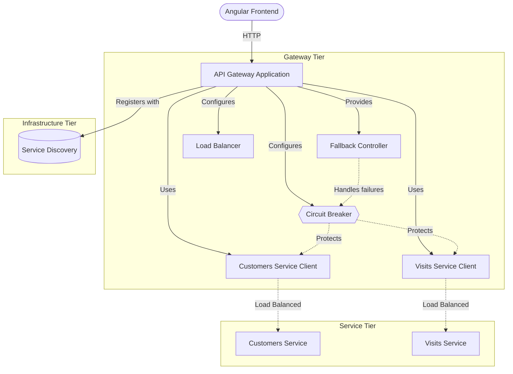
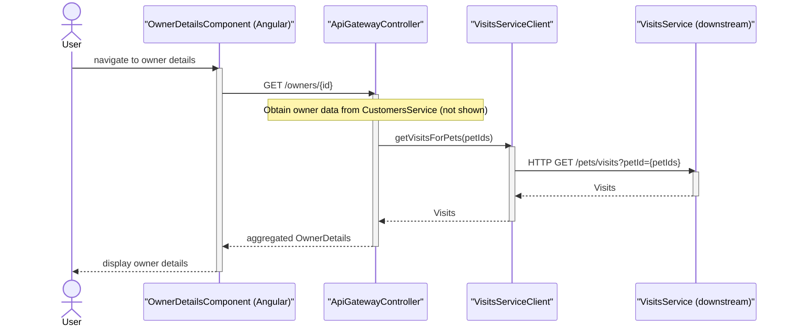
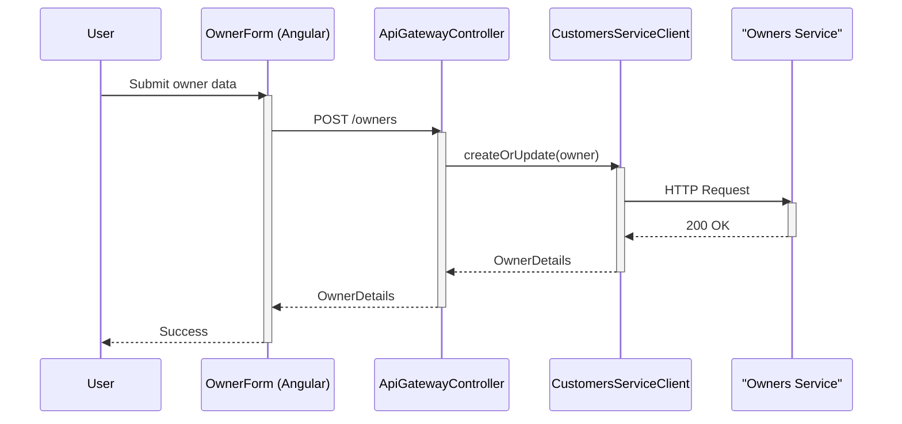
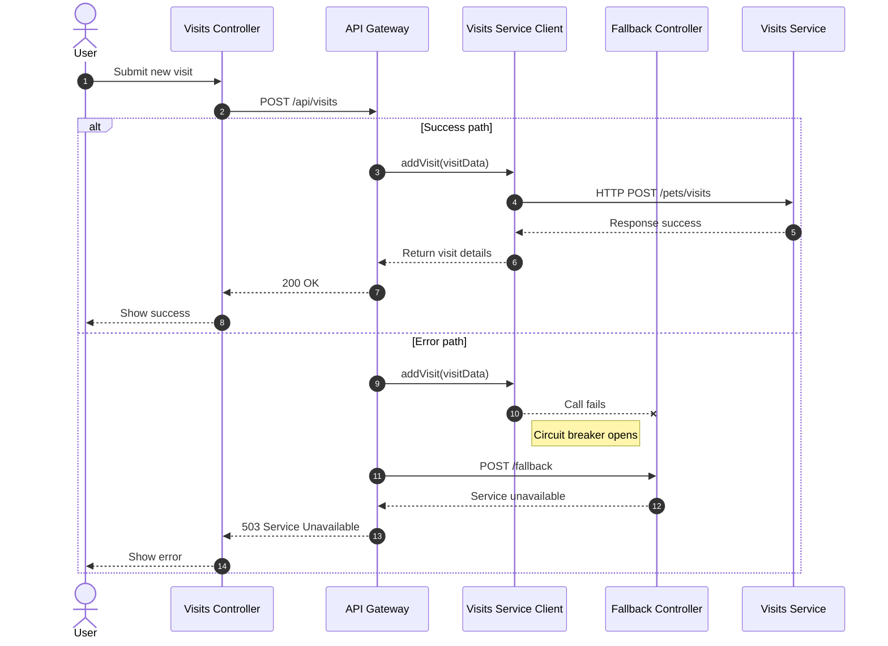

# System Architecture


API gateway aggregating data from the PetClinic microservices with circuit breaker fault tolerance and an AngularJS single-page application frontend.

The PetClinic API Gateway serves as the single entry point for the PetClinic microservices system. It aggregates data from downstream services (customers, visits, vets), applies Resilience4J circuit breaker patterns for fault tolerance, and serves the AngularJS-based user interface. The gateway communicates with backend services via load-balanced, reactive WebClient calls and constructs composite response objects using a fluent builder API.

---

## Overview

The `petclinic-api-gateway` is the central routing and aggregation layer in the Spring PetClinic microservices architecture. It receives client requests, delegates to the appropriate backend services, merges the responses into unified data transfer objects, and returns them to the frontend.

This gateway coordinates with three downstream microservices:

| Service | Repository | Responsibility |
|---|---|---|
| **Customers Service** | `petclinic-customers-service` | Owner and pet data (CRUD operations) |
| **Visits Service** | `petclinic-visits-service` | Pet visit records (read and create) |
| **Vets Service** | `petclinic-vets-service` | Veterinarian data |

The gateway also serves the AngularJS single-page application from its static resources, providing views for owner management, pet forms, visit tracking, vet listings, and a chat interface.



### Key Architectural Components

| Layer | Package | Purpose |
|---|---|---|
| **Application Bootstrap** | `api` | Spring Boot main class, bean configuration, service discovery |
| **Service Clients** | `api.application` | Reactive HTTP clients for downstream service calls |
| **REST Controllers** | `api.boundary.web` | API endpoints and fallback handling |
| **Data Transfer Objects** | `api.dto` | Fluent builder-pattern DTOs for aggregated data |
| **Frontend** | `static/scripts` | AngularJS modules, controllers, and templates |

```mermaid
classDiagram
    %% Backend Core Classes and DTOs - petclinic-api-gateway
    %% Based on repository context

    namespace api_gateway {
        class ApiGatewayApplication {
            <<Main>>
            -Resource indexHtml
            +main(String[] args)$
            +loadBalancedRestTemplate()$: RestTemplate
            +loadBalancedWebClientBuilder()$: WebClient_Builder
            +routerFunction()$: RouterFunction
            +defaultCustomizer()$: Customizer
        }
    }

    namespace boundary_web {
        class ApiGatewayController {
            <<RestController>>
        }
        class FallbackController {
            <<RestController>>
            +fallback()$: ResponseEntity
        }
    }

    namespace application {
        class VisitsServiceClient {
            <<Component>>
            -String hostname
            -WebClient_Builder webClientBuilder
            +VisitsServiceClient(WebClient_Builder webClientBuilder)
            +getVisitsForPets(List petIds)$: Mono
            -joinIds(List petIds)$: String
            +setHostname(String hostname)
        }
        class CustomersServiceClient {
            <<Component>>
        }
    }

    namespace dto {
        class OwnerDetails {
            <<DTO>>
            -int id
            -String firstName
            -String lastName
            -String address
            -String city
            -String telephone
            -List~PetDetails~ pets
        }
        class PetDetails {
            <<DTO>>
        }
        class VisitDetails {
            <<DTO>>
        }
        class PetType {
            <<DTO>>
        }
    }

    %% Relationships based on context
    ApiGatewayController --> VisitsServiceClient : uses
    ApiGatewayController --> CustomersServiceClient : uses
    OwnerDetails "1" *-- "0..*" PetDetails : contains
```



---

## Features

- **Service Aggregation** — Merges data from the customers and visits services into a single composite `OwnerDetails` response via `GET /api/gateway/owners/{ownerId}`
- **Resilience4J Circuit Breakers** — Applies configurable circuit breaker and time limiter patterns (10-second timeout) to downstream service calls, with fallback responses when services are unavailable
- **Reactive WebClient Communication** — Uses Spring WebFlux `WebClient` with load balancing (`@LoadBalanced`) for non-blocking HTTP calls to backend microservices
- **Fluent Builder DTOs** — Provides `OwnerDetailsBuilder` and `PetDetailsBuilder` with a static factory API for constructing response objects
- **Service Discovery Integration** — Uses Netflix Eureka client (`@EnableDiscoveryClient`) for dynamic service registration and lookup
- **AngularJS Single-Page Application** — Serves a complete UI with UI Router navigation for owner listing, owner details, owner forms, pet forms, visit management, and vet listings
- **Chat Interface** — Includes a JavaScript-based chat feature with message handling, UI controls, and localStorage persistence
- **Fallback Handling** — Provides a `POST /fallback` endpoint returning a `503 Service Unavailable` response when downstream services cannot be reached



---

## Requirements

- **Java** — Runtime environment (Spring Boot application)
- **Maven** — Build tool and dependency management
- **Service Discovery** — Netflix Eureka server must be running for service registration
- **Downstream Services** — The following services must be registered with Eureka:
  - `customers-service`
  - `visits-service`
  - `vets-service`

### Key Dependencies

| Dependency | Purpose |
|---|---|
| `spring-cloud-starter-circuitbreaker-reactor-resilience4j` | Circuit breaker and fault tolerance |
| `spring-cloud-starter-config` | Externalized configuration |
| `spring-cloud-starter-netflix-eureka-client` | Service discovery |
| `spring-cloud-starter-gateway-server-webflux` | Reactive API gateway |
| `spring-boot-starter-actuator` | Health checks and metrics |
| `spring-boot-starter-zipkin` | Distributed tracing |
| `caffeine` | Local caching |
| `micrometer-registry-prometheus` | Metrics export |
| `resilience4j-micrometer` | Resilience4J metrics |

---

## Installation

### Build from Source

```bash
# Clone the repository
git clone <repository-url>
cd petclinic-api-gateway

# Build the project
mvn clean package
```

### Docker Build

The project includes a Docker build profile:

```bash
mvn clean package -PbuildDocker
```

The Docker image exposes port **8081** by default.

### CSS Compilation (Optional)

A separate Maven profile compiles SCSS stylesheets using Bootstrap:

```bash
mvn generate-resources -Pcss
```

---

## Quick Start

1. Start the required infrastructure services (Eureka, downstream microservices)
2. Build and run the gateway:

```bash
mvn spring-boot:run
```

3. Verify the application is running:

```bash
curl http://localhost:8080/api/gateway/owners/1
```

Expected output — a JSON object containing owner details with nested pet and visit data:

```json
{
  "id": 1,
  "firstName": "George",
  "lastName": "Franklin",
  "address": "110 W. Liberty St.",
  "city": "Madison",
  "telephone": "6085551023",
  "pets": [
    {
      "id": 1,
      "name": "Leo",
      "birthDate": "2000-09-07",
      "type": { "id": 1, "name": "cat" },
      "visits": []
    }
  ]
}
```

4. Access the web interface at `http://localhost:8080/`

---

## Usage

### Owner Details Retrieval

The primary API endpoint aggregates owner and visit data through a circuit breaker:

```
GET /api/gateway/owners/{ownerId}
```

**Flow:**

1. `CustomersServiceClient.getOwner(ownerId)` calls the customers service at `http://customers-service/owners/{ownerId}`
2. `VisitsServiceClient.getVisitsForPets(petIds)` calls the visits service at `http://visits-service/pets/visits?petId={petId}`
3. The `ApiGatewayController` merges visit data into the owner's pets via `addVisitsToOwner()`
4. If the visits service is unavailable, the circuit breaker returns an empty visits list via `emptyVisitsForPets()`

```java
// The gateway controller orchestrates the aggregation
@GetMapping(value = "owners/{ownerId}")
public Mono<OwnerDetails> getOwnerDetails(final @PathVariable int ownerId) {
    return customersServiceClient.getOwner(ownerId)
        .flatMap(owner ->
            visitsServiceClient.getVisitsForPets(owner.getPetIds())
                .transform(it -> {
                    ReactiveCircuitBreaker cb = cbFactory.create("getOwnerDetails");
                    return cb.run(it, throwable -> emptyVisitsForPets());
                })
                .map(addVisitsToOwner(owner))
        );
}
```

### Building OwnerDetails with the Fluent API

The gateway constructs `OwnerDetails` objects using a builder pattern:

```java
OwnerDetails owner = OwnerDetails.anOwnerDetails()
    .id(1)
    .firstName("George")
    .lastName("Franklin")
    .address("110 W. Liberty St.")
    .city("Madison")
    .telephone("6085551023")
    .pets(List.of(
        PetDetails.aPetDetails()
            .id(1)
            .name("Leo")
            .birthDate(LocalDate.of(2000, 9, 7))
            .type(new PetType(1, "cat"))
            .visits(new ArrayList<>())
            .build()
    ))
    .build();
```

### Building PetDetails

```java
PetDetails pet = PetDetails.aPetDetails()
    .id(1)
    .name("Leo")
    .birthDate(LocalDate.of(2000, 9, 7))
    .type(new PetType(1, "cat"))
    .visits(new ArrayList<>())
    .build();
```

### Fallback Behavior

When a downstream service is unreachable, the circuit breaker activates and returns a degraded response. The `FallbackController` provides a dedicated fallback endpoint:

```
POST /fallback
→ 503 Service Unavailable
```

The Resilience4J configuration applies default settings: standard circuit breaker states and a 10-second time limiter timeout.



