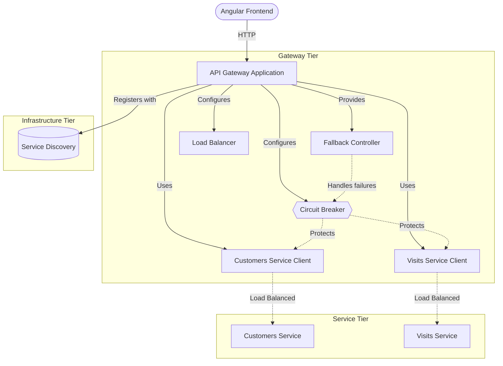

# Deployment Instructions


API gateway deployment guide for the PetClinic microservices architecture.

The `petclinic-api-gateway` service acts as the single entry point for the PetClinic application, routing requests to downstream microservices, aggregating responses, and serving the AngularJS-based frontend. This document covers build, configuration, and deployment procedures for the gateway service.

## Overview

The PetClinic API Gateway is a Spring Boot application that provides a unified interface to three downstream microservices: `petclinic-customers-service`, `petclinic-vets-service`, and `petclinic-visits-service`. It aggregates data from these services — for example, combining owner details from the customers service with visit records from the visits service — and exposes combined endpoints to clients.

The gateway also serves the AngularJS single-page application that provides the user interface for managing owners, pets, visits, and veterinarians.

### System Architecture



### Key Components

| Component | Location | Purpose |
|-----------|----------|---------|
| `ApiGatewayApplication` | `src/main/java/.../api/ApiGatewayApplication.java` | Spring Boot entry point; configures beans, load-balanced clients, and Resilience4J defaults |
| `ApiGatewayController` | `src/main/java/.../boundary/web/ApiGatewayController.java` | REST controller aggregating owner and visit data via circuit breaker |
| `CustomersServiceClient` | `src/main/java/.../application/CustomersServiceClient.java` | WebClient-based client for the customers service |
| `VisitsServiceClient` | `src/main/java/.../application/VisitsServiceClient.java` | WebClient-based client for the visits service |
| `FallbackController` | `src/main/java/.../boundary/web/FallbackController.java` | Fallback endpoint for service unavailability scenarios |
| DTOs (`OwnerDetails`, `PetDetails`, `Visits`, etc.) | `src/main/java/.../dto/` | Data transfer objects with fluent builder APIs |
| AngularJS frontend | `src/main/resources/static/` | SPA served by the gateway for owner, pet, visit, and vet management |

## Features

- **Service Aggregation**: Combines data from customers, visits, and vets services into unified API responses through `ApiGatewayController`
- **Resilience4J Circuit Breaking**: Configurable circuit breaker and time limiter (10-second default timeout) for fault tolerance against downstream service failures
- **Load-Balanced Service Discovery**: Integrates with Netflix Eureka for dynamic service resolution; HTTP clients (`WebClient` and `RestTemplate`) are annotated with `@LoadBalanced`
- **Reactive HTTP Clients**: Uses Spring WebFlux `WebClient` for non-blocking calls to the customers and visits services
- **AngularJS Frontend**: Serves a single-page application with views for owner listing, owner details, pet forms, visit management, and veterinarian listing
- **Static Resource Routing**: Configures a `RouterFunction` bean to serve static resources and the `index.html` entry point
- **Fallback Handling**: Provides a `POST /fallback` endpoint for graceful degradation when downstream services are unavailable

## Requirements

- **Java**: JDK 17 or later (required by Spring Boot 3.x / Spring Cloud)
- **Apache Maven**: 3.9+ (project uses Maven as its build tool)
- **Docker**: Required if deploying via container (exposed port: `8081`)
- **Service Dependencies**:
  - `petclinic-customers-service` — must be running and registered with Eureka
  - `petclinic-visits-service` — must be running and registered with Eureka
  - `petclinic-vets-service` — required for the vet list view in the frontend
  - **Eureka Service Registry** — required for service discovery; all services must register
- **Spring Cloud Config Server**: Optional; the gateway includes the `spring-cloud-starter-config` dependency

## Installation

### Build from Source

```bash
# Clone the repository
git clone https://github.com/audoclyphia-evals/petclinic-api-gateway.git
cd petclinic-api-gateway

# Compile and package
mvn clean package

# Skip tests during build (optional)
mvn clean package -DskipTests
```

### Build Docker Image

The project includes a `buildDocker` Maven profile:

```bash
mvn clean package -PbuildDocker
```

The Docker image exposes port `8081` as configured in `pom.xml` via the `docker.image.exposed.port` property.

## Quick Start

### 1. Start Eureka Service Registry

The gateway requires Eureka for service discovery. Start the Eureka server first.

### 2. Start Downstream Services

Ensure the following services are running and registered with Eureka:

```bash
# In separate terminals or via Docker
# customers-service, visits-service, vets-service
```

### 3. Start the API Gateway

```bash
# Using Maven
mvn spring-boot:run

# Or using the packaged JAR
java -jar target/spring-petclinic-api-gateway-4.0.1.jar
```

### 4. Verify

Access the gateway at `http://localhost:8081`. The AngularJS frontend should load with the welcome page. Test the owner details endpoint:

```bash
curl http://localhost:8081/api/gateway/owners/1
```

A successful response returns an `OwnerDetails` JSON object containing owner information and associated pet/visit data.

## Usage

### Retrieve Owner Details with Visits

The primary aggregated endpoint fetches owner data from the customers service and enriches it with visit records from the visits service, protected by a circuit breaker named `getOwnerDetails`.

```
GET /api/gateway/owners/{ownerId}
```

```bash
curl http://localhost:8081/api/gateway/owners/1
```

**Example response:**

```json
{
  "id": 1,
  "firstName": "George",
  "lastName": "Franklin",
  "address": "110 W. Liberty St.",
  "city": "Madison",
  "telephone": "6085551023",
  "pets": [
    {
      "id": 10,
      "name": "Leo",
      "birthDate": "2000-09-07",
      "type": { "id": 6, "name": "cat" },
      "visits": []
    }
  ]
}
```

If the visits service is unreachable, the circuit breaker returns empty visits for all pets rather than failing the entire request.

### Fallback Endpoint

The gateway exposes a fallback endpoint for service unavailability scenarios:

```
POST /fallback
```

```bash
curl -X POST http://localhost:8081/fallback
```

Returns an HTTP 503 Service Unavailable response when called.

### Owner Details Builder (DTO Construction)

The gateway uses a fluent builder pattern for constructing `OwnerDetails` and `PetDetails` objects internally:

```java
import org.springframework.samples.petclinic.api.dto.OwnerDetails;

OwnerDetails owner = OwnerDetails.anOwnerDetails()
    .id(1)
    .firstName("George")
    .lastName("Franklin")
    .address("110 W. Liberty St.")
    .city("Madison")
    .telephone("6085551023")
    .pets(List.of(
        PetDetails.aPetDetails()
            .id(10)
            .name("Leo")
            .type(new PetType(6, "cat"))
            .birthDate(LocalDate.of(2000, 9, 7))
            .visits(new ArrayList<>())
            .build()
    ))
    .build();
```

### AngularJS Frontend Views

The SPA served at the root URL provides the following views:

| View | Route Module | Description |
|------|-------------|-------------|
| Welcome | `fragments/welcome.html` | Landing page |
| Owner List | `owner-list/` | Search and list owners (calls customers service) |
| Owner Details | `owner-details/` | Owner info with pets and visits |
| Owner Form | `owner-form/` | Create or edit an owner |
| Pet Form | `pet-form/` | Create or edit a pet |
| Vet List | `vet-list/` | List of veterinarians (calls vets service) |
| Visits | `visits/` | View and add visits for a pet |

### Circuit Breaker Configuration

Resilience4J is configured with default circuit breaker settings and a 10-second time limiter timeout in `ApiGatewayApplication`:

```java
@Bean
public Customizer<ReactiveResilience4JCircuitBreakerFactory> defaultCustomizer() {
    return factory -> factory.configureDefault(id -> new Resilience4JConfigBuilder(id)
        .circuitBreakerConfig(CircuitBreakerConfig.ofDefaults())
        .timeLimiterConfig(TimeLimiterConfig.custom()
            .timeoutDuration(Duration.ofSeconds(10))
            .build())
        .build());
}
```

This applies to all reactive circuit breakers created through the factory, including the `getOwnerDetails` circuit breaker used in `ApiGatewayController`.