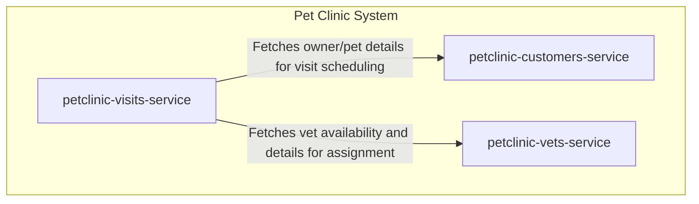

# Pet Clinic System - Multi-Service Architecture

## Project Description
The Pet Clinic system is a microservices-based application designed to manage the core operations of a veterinary clinic. The system is decomposed into three independent, domain-specific services: managing customers and their pets, scheduling and recording veterinary appointments (visits), and maintaining information about the veterinary staff. Each service owns its data and business logic, communicating via networked APIs to fulfill end-to-end user workflows.

## System Architecture
The diagram below illustrates the high-level architecture and interaction between the services that comprise the Pet Clinic system.

## Services / Components

| Service | Description |
| :--- | :--- |
| **petclinic-customers-service** | Manages all customer-related data, including pet owners, their contact information, and the pets registered under each owner. Serves as the primary source for client and animal records. |
| **petclinic-visits-service** | Handles the scheduling and recording of veterinary appointments. This service coordinates the creation of a visit by linking a customer's pet with an available veterinarian and a specific time slot. |
| **petclinic-vets-service** | Maintains information about the veterinary staff, including their credentials, specialties, and scheduling availability. Provides the data needed to assign vets to visits. |

## Communication Patterns
The services within the Pet Clinic system communicate primarily through **synchronous REST APIs**.

-   The **visits-service** acts as a coordinator during the appointment booking process. To schedule a visit, it must first validate and fetch detailed information about the pet from the **customers-service** and retrieve a suitable, available veterinarian from the **vets-service**.
-   Each service is responsible for its own data storage and business logic. They expose well-defined API contracts for data retrieval and mutation, allowing for independent development, scaling, and deployment.
-   This direct, API-to-API communication model implies that services must be able to discover and reach each other at runtime, often facilitated by a service registry or static configuration within a deployment environment.