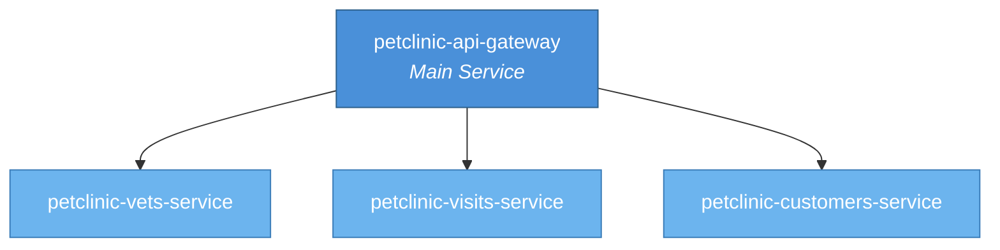

# Pet Clinic

**A microservices-based veterinary clinic management platform.**

The Pet Clinic project is a distributed system for managing veterinary clinic operations, including customer information, pet visits, and veterinarian management. It uses an API gateway pattern to route requests to individual backend services, each responsible for a specific domain.

---

## System Architecture

> **Note:** The diagram above illustrates the logical architectural layout based on component roles. The recorded topology data contains no explicit cross-repository call edges (`inbound` and `outbound` are empty), so specific inter-service communication patterns (e.g., REST, gRPC, events) could not be determined from the available context. The relationships shown reflect the standard API gateway → backend service pattern implied by the repository names and project structure.

---

## Services / Components

### petclinic-api-gateway *(Main Service)*

- **Repository:** `audoclyphia-evals/petclinic-api-gateway`
- **Description:** The API gateway serves as the single entry point for all client requests in the Pet Clinic system. It routes, aggregates, and proxies requests to the appropriate backend microservices. It handles cross-cutting concerns such as request routing, authentication, and load balancing.
- **Primary Languages:** Java, JavaScript
- **Role:** Central gateway and routing layer for the microservices architecture.

---

### petclinic-vets-service

- **Repository:** `audoclyphia-evals/petclinic-vets-service`
- **Description:** A backend microservice responsible for managing veterinarian data — including veterinarian profiles, specialties, and availability. This service handles all domain logic related to the veterinary staff.
- **Primary Language:** Java (inferred from project stack)
- **Role:** Domain service for veterinarian management.

---

### petclinic-visits-service

- **Repository:** `audoclyphia-evals/petclinic-visits-service`
- **Description:** A backend microservice responsible for managing pet visit records — including scheduling, visit details, and visit history. This service handles all domain logic related to clinical encounters.
- **Primary Language:** Java (inferred from project stack)
- **Role:** Domain service for visit and appointment management.

---

### petclinic-customers-service

- **Repository:** `audoclyphia-evals/petclinic-customers-service`
- **Description:** A backend microservice responsible for managing customer (pet owner) data — including owner profiles, pet registrations, and owner-pet relationships. This service handles all domain logic related to clients and their pets.
- **Primary Language:** Java (inferred from project stack)
- **Role:** Domain service for customer and pet management.

---

## Communication Patterns

The Pet Clinic follows an **API Gateway microservices architecture** where the `petclinic-api-gateway` acts as the front door for all incoming requests and delegates to the appropriate backend service.

**Topology data:** The recorded cross-repository topology is empty — no explicit inbound or outbound call edges were captured between the repositories. As a result, the specific communication protocols (e.g., REST, gRPC, message queues) and exact API contracts between the gateway and backend services are not documented in the available context.

**Observed architectural roles:**

| Component | Role |
|---|---|
| `petclinic-api-gateway` | Entry point; routes and proxies requests to backend services |
| `petclinic-vets-service` | Domain service: veterinarians & specialties |
| `petclinic-visits-service` | Domain service: visits & appointments |
| `petclinic-customers-service` | Domain service: customers & pets |

The project structure and repository naming are consistent with a Spring Cloud / Spring Boot microservices pattern (Java-based), where the gateway typically uses Spring Cloud Gateway or Zuul to route HTTP/REST requests to downstream services. However, this is an inference based on the stack and naming; explicit call patterns are not confirmed by the topology data.