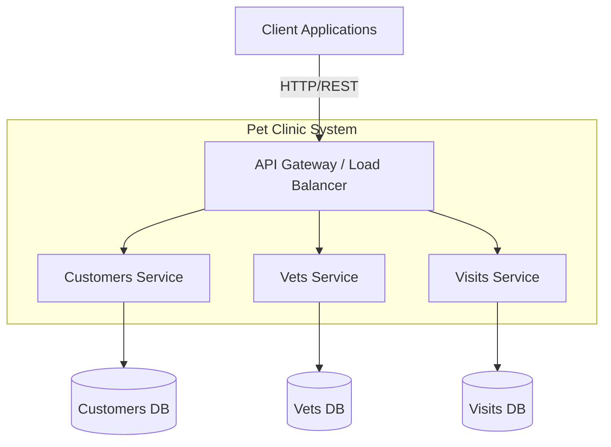

# Pet Clinic System - Project Overview

## Project Description
This is a microservices architecture for managing a veterinary pet clinic. The system is composed of multiple independent services that collectively handle customer management, veterinarian administration, and pet visit scheduling.

## System Architecture

## Services / Components

### 1. Customers Service
- **Repository**: `audoclyphia-evals/petclinic-customers-service`
- **Responsibility**: Manages customer and pet owner information, including contact details, addresses, and their associated pets.
- **Key Data**: Pet owners, pets (species, birth date, etc.)

### 2. Vets Service
- **Repository**: `audoclyphia-evals/petclinic-vets-service`
- **Responsibility**: Manages veterinarian data, including profiles, specializations, schedules, and availability.
- **Key Data**: Veterinarians, specialties (e.g., dentistry, radiology)

### 3. Visits Service
- **Repository**: `audoclyphia-evals/petclinic-visits-service`
- **Responsibility**: Handles the scheduling and recording of veterinary visits, linking customers/pets with veterinarians for appointments.
- **Key Data**: Visit records (date, description, pet, vet, owner)

## Communication Patterns

### Synchronous Communication
- **API Gateway**: Acts as the single entry point for all client requests, routing them to the appropriate microservice.
- **Inter-service Calls**: Services may call each other synchronously via RESTful APIs to fetch related data (e.g., the Visits Service retrieving pet and vet details to create a complete visit record).

### Asynchronous Communication (Future Consideration)
- While not explicitly defined in the current topology, the architecture supports event-driven patterns where services publish domain events (e.g., `VisitCreated`, `PetRegistered`) to a message broker for other services to consume, enabling loose coupling.

### Data Isolation
Each service owns its data store, following the Database per Service pattern. Services expose their data only through well-defined APIs, ensuring clear ownership and boundary management.