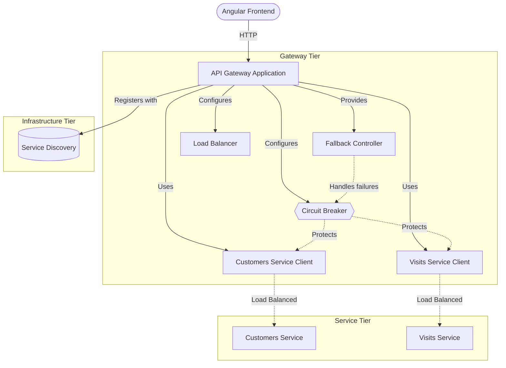
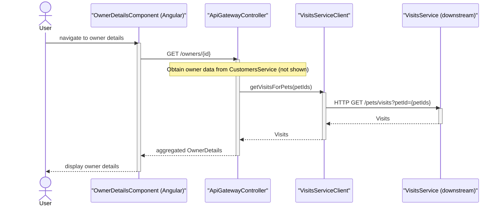
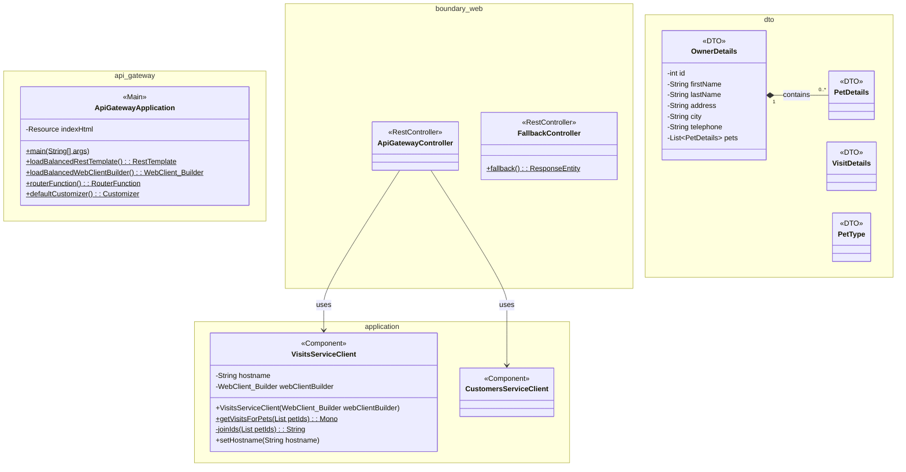
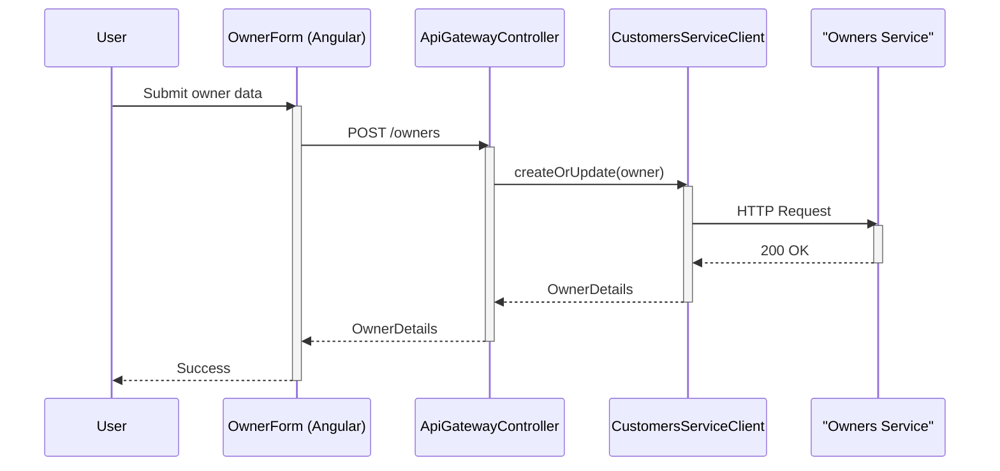
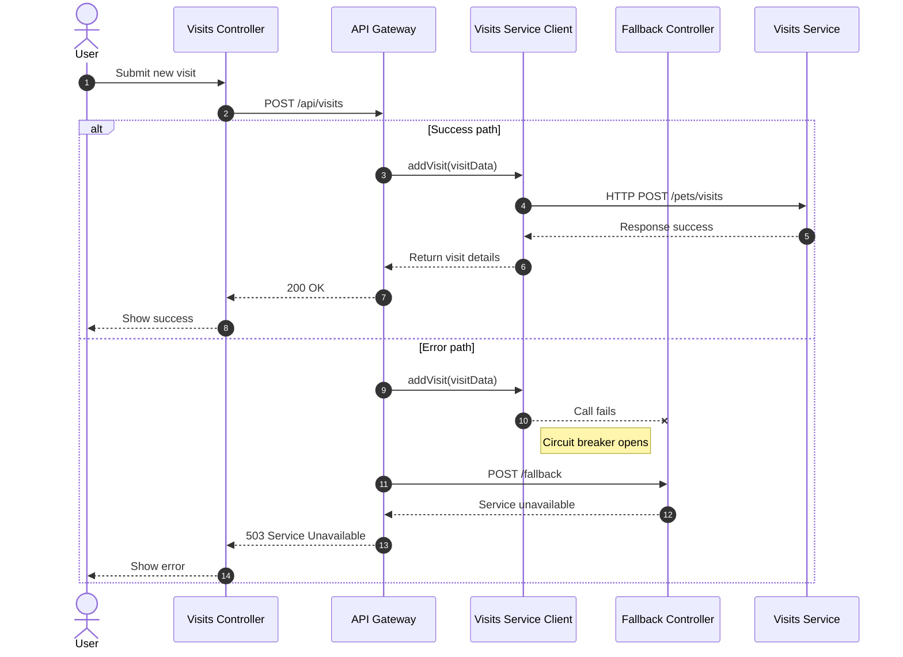

# API Gateway Reference

Microservices API gateway for the PetClinic application, aggregating data from multiple backend services.


The `petclinic-api-gateway` module serves as the central entry point for the PetClinic microservices architecture. It aggregates data from the customers, visits, and vets services, applying circuit breaker patterns for fault tolerance and serving an AngularJS-based single-page application for owner, pet, visit, and veterinarian management.

## Overview

The API Gateway acts as a unified facade over the PetClinic microservices ecosystem. It performs server-side data aggregation, combines responses from multiple downstream services into composite responses, and applies resilience patterns to handle partial service failures gracefully.

The gateway sits between the client (browser-based AngularJS application) and three backend microservices:

- **petclinic-customers-service** — manages owners, pets, and related CRUD operations
- **petclinic-visits-service** — manages visit records for pets
- **petclinic-vets-service** — provides the list of veterinarians



### Key Components

| Component | Location | Purpose |
|-----------|----------|---------|
| `ApiGatewayApplication` | `api/ApiGatewayApplication.java` | Spring Boot entry point; configures load-balanced clients, Resilience4J defaults, and static resource routing |
| `ApiGatewayController` | `api/boundary/web/ApiGatewayController.java` | REST controller aggregating owner and visit data via circuit breaker |
| `CustomersServiceClient` | `api/application/CustomersServiceClient.java` | Reactive WebClient for the customers service |
| `VisitsServiceClient` | `api/application/VisitsServiceClient.java` | Reactive WebClient for the visits service |
| `FallbackController` | `api/boundary/web/FallbackController.java` | Fallback endpoint for service unavailability |
| DTO classes | `api/dto/` | `OwnerDetails`, `PetDetails`, `PetType`, `Visits`, `VisitDetails` data transfer objects |
| AngularJS frontend | `resources/static/scripts/` | Single-page application with views for owners, pets, vets, and visits |

## Features

- **Data aggregation** — Combines owner information with visit data in a single API call to the `GET /api/gateway/owners/{ownerId}` endpoint
- **Circuit breaker pattern** — Uses Resilience4J via Spring Cloud Circuit Breaker to wrap downstream service calls, returning empty visit data if the visits service is unavailable
- **Reactive HTTP clients** — Load-balanced `WebClient` instances for non-blocking communication with backend microservices
- **Service discovery** — Integrates with Netflix Eureka for dynamic service location
- **AngularJS frontend** — Single-page application providing views for owner listing, owner creation/editing, pet management, visit management, and veterinarian listing
- **Fluent builder DTOs** — `OwnerDetailsBuilder` and `PetDetailsBuilder` for constructing data transfer objects using a readable builder pattern
- **Fallback handling** — Dedicated fallback endpoint for graceful degradation when downstream services are unreachable
- **Chat interface** — JavaScript-based chat component with message persistence via `localStorage`
- **Default resilience configuration** — Global Resilience4J circuit breaker and time limiter settings (10-second timeout) applied to all reactive circuit breakers

## Requirements

- Java 17 or higher
- Maven 3.6+
- Spring Boot 3.x (managed via parent POM `spring-petclinic-microservices` version 4.0.1)
- Running instances of the downstream services (customers-service, visits-service, vets-service)
- Netflix Eureka service registry for service discovery

### Key Dependencies

| Dependency | Purpose |
|------------|---------|
| `spring-cloud-starter-netflix-eureka-client` | Service registration and discovery |
| `spring-cloud-starter-circuitbreaker-reactor-resilience4j` | Circuit breaker and time limiter |
| `spring-cloud-starter-gateway-server-webflux` | Reactive gateway support |
| `spring-cloud-starter-config` | Externalized configuration |
| `spring-boot-starter-actuator` | Health checks and monitoring |
| `spring-boot-starter-zipkin` | Distributed tracing |
| `resilience4j-micrometer` | Resilience4J metrics export |
| `micrometer-registry-prometheus` | Prometheus metrics |
| `caffeine` | In-memory caching |

## Installation

### Clone and Build

```bash
# Clone the repository
git clone https://github.com/audoclyphia-evals/petclinic-api-gateway.git
cd petclinic-api-gateway

# Build the project
mvn clean package
```

### Run

```bash
# Start the API gateway (default port 8081)
mvn spring-boot:run
```

The application registers itself with the Eureka service discovery server and expects the following services to be available:

- `customers-service`
- `visits-service`
- `vets-service`

### Verify

```bash
# Check application health via Actuator
curl http://localhost:8081/actuator/health
```

## Quick Start

1. Start the Eureka service registry
2. Start the customers-service, visits-service, and vets-service
3. Start the API gateway:

```bash
mvn spring-boot:run
```

4. Open `http://localhost:8081` in a browser to access the AngularJS application
5. Test the aggregated owner details endpoint:

```bash
curl http://localhost:8081/api/gateway/owners/1
```

Expected response (JSON with owner details and embedded visits):

```json
{
  "id": 1,
  "firstName": "George",
  "lastName": "Franklin",
  "address": "110 W. Liberty St.",
  "city": "Madison",
  "telephone": "6085551023",
  "pets": [
    {
      "id": 1,
      "name": "Leo",
      "birthDate": "2000-09-07",
      "type": { "id": 1, "name": "cat" },
      "visits": []
    }
  ]
}
```

## Usage

### Aggregated Owner Details

The primary backend endpoint aggregates owner data from the customers service and visits from the visits service, attaching visits to each pet:



```
GET /api/gateway/owners/{ownerId}
```

The `ApiGatewayController` calls `CustomersServiceClient.getOwner(ownerId)` to retrieve owner and pet data, then calls `VisitsServiceClient.getVisitsForPets(petIds)` to fetch associated visits. The visits are matched to pets by ID via `addVisitsToOwner`. If the visits service call fails, the circuit breaker returns empty visits via `emptyVisitsForPets`.

### Building DTOs with the Fluent API

The `OwnerDetailsBuilder` and `PetDetailsBuilder` provide a readable way to construct data transfer objects:



```java
import org.springframework.samples.petclinic.api.dto.OwnerDetails;
import org.springframework.samples.petclinic.api.dto.PetDetails;
import org.springframework.samples.petclinic.api.dto.PetType;

// Build an OwnerDetails instance
OwnerDetails owner = OwnerDetailsBuilder.anOwnerDetails()
    .id(1)
    .firstName("George")
    .lastName("Franklin")
    .address("110 W. Liberty St.")
    .city("Madison")
    .telephone("6085551023")
    .pets(List.of(
        PetDetailsBuilder.aPetDetails()
            .id(1)
            .name("Leo")
            .birthDate(LocalDate.of(2000, 9, 7))
            .type(new PetType(1, "cat"))
            .visits(new ArrayList<>())
            .build()
    ))
    .build();

// Extract pet IDs for batch visit lookup
List<Integer> petIds = owner.getPetIds();
```

### Owner Form Submission

The AngularJS owner form controller handles both creation and editing of owners by calling the customers-service directly:



```javascript
// From owner-form.controller.js
// When an ownerId is provided, loads existing owner data via GET
// On submission, sends PUT (edit) or POST (create) to the customers service
```

### Visit Submission

The visits view controller manages loading existing visits and submitting new visit records:



```javascript
// From visits.controller.js
// Loads visits for a pet from the visits-service
// Submits new visit records to the visits-service
```

### Service Client Configuration

The `VisitsServiceClient` uses a configurable hostname (defaulting to `http://visits-service/`) to support integration testing:

```java
@Component
public class VisitsServiceClient {

    private String hostname = "http://visits-service/";
    private final WebClient.Builder webClientBuilder;

    public Mono<Visits> getVisitsForPets(final List<Integer> petIds) {
        return webClientBuilder.build()
            .get()
            .uri(hostname + "pets/visits?petId={petId}", joinIds(petIds))
            .retrieve()
            .bodyToMono(Visits.class);
    }
}
```

### Resilience4J Configuration

The default circuit breaker is configured in `ApiGatewayApplication` with a 10-second time limiter:

```java
@Bean
public Customizer<ReactiveResilience4JCircuitBreakerFactory> defaultCustomizer() {
    return factory -> factory.configureDefault(id -> new Resilience4JConfigBuilder(id)
        .circuitBreakerConfig(CircuitBreakerConfig.ofDefaults())
        .timeLimiterConfig(TimeLimiterConfig.custom()
            .timeoutDuration(Duration.ofSeconds(10)).build())
        .build());
}
```

### Fallback Endpoint

The `FallbackController` provides a `POST /fallback` endpoint that returns a service unavailable response when downstream services are unreachable:

```java
@PostMapping("/fallback")
public ResponseEntity<String> fallback() {
    return ResponseEntity.status(HttpStatus.SC_SERVICE_UNAVAILABLE)
        .body("Chat is currently unavailable. Please try again later.");
}
```